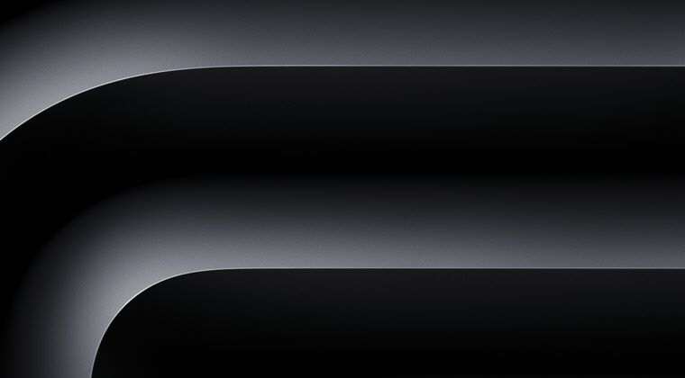
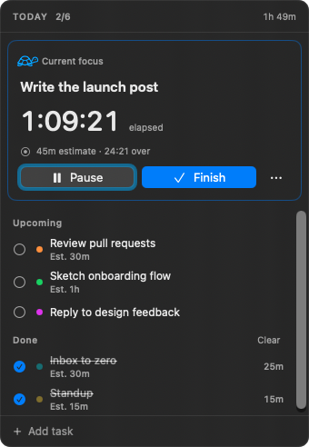
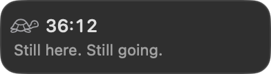
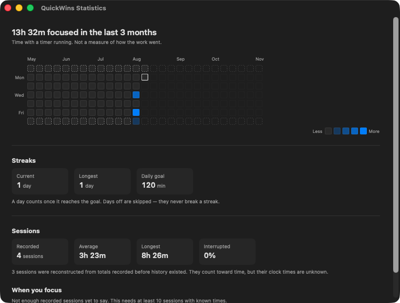
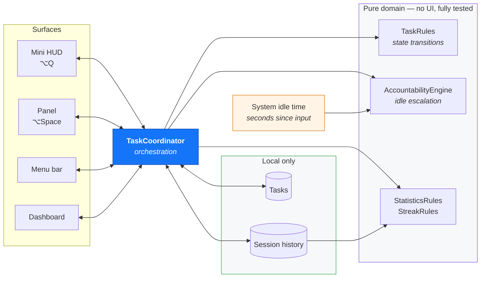
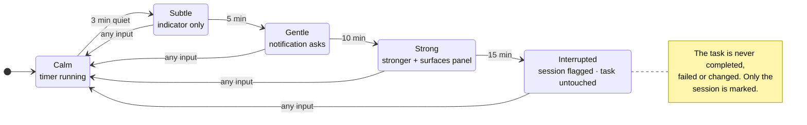
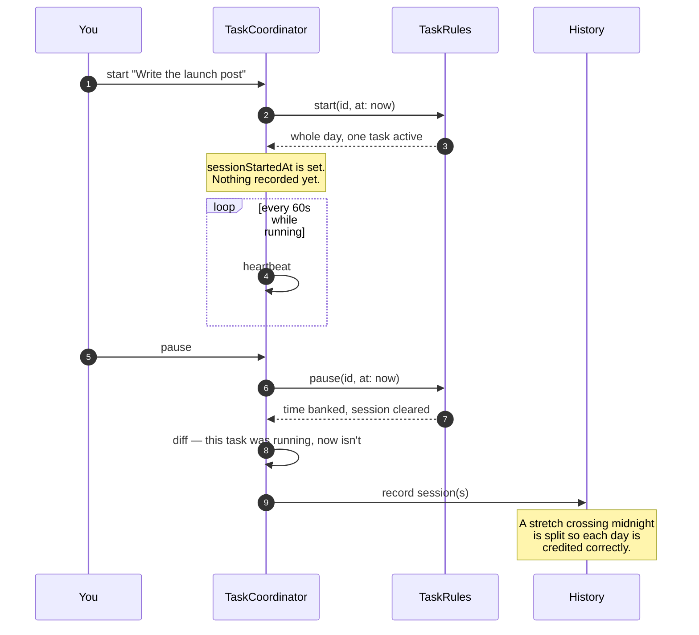

<div align="center">

# QuickWins

### Turns *"where did today go?"* into an answer you can look at.

A macOS menu-bar app that runs a timer on **exactly one thing at a time**, notices when your Mac
goes quiet, and keeps an honest record of where your attention actually went.

<br>


<br>



<sub>The HUD stays pinned beside your pointer. It's click-through, so it never blocks what's underneath.</sub>

</div>

---

## The outcome

Three effects, in descending order of how much they change a day.

<table>
<tr>
<td width="33%" valign="top">

### One task at a time
**Enforced, not suggested.**

Starting something pauses whatever was running. You cannot have four things "in progress" — so
every switch is a decision you make on purpose, and the app records that you made it.

</td>
<td width="33%" valign="top">

### Time measured, not guessed
**Derived from timestamps.**

Elapsed time survives quitting, sleeping and crashing. What you see is what happened — including
the parts you'd round up in your head.

</td>
<td width="33%" valign="top">

### Attention becomes a picture
**Six months at a glance.**

A contribution graph, streaks, session lengths, interruption rate, and eventually the hours you
genuinely focus best.

</td>
</tr>
</table>

> **What it deliberately won't do:** tell you that you were unproductive. The app observes exactly
> one number — seconds since your last keypress. It never claims to know more than that.

---

## Product walkthrough

### 1 · The panel — `⌥Space`

<div align="center">

</div>

Opens beside your pointer, closes on Escape. The active task dominates: elapsed time, estimate,
and how far past it you are. Everything else is a quiet list. Colour dots identify tasks at a
glance, and the tortoise shows whether the timer is genuinely running.

### 2 · The HUD — `⌥Q`

<div align="center">

</div>

Stays on screen all day. When your pointer rests, it offers one short line and holds it until you
move again — never a new one every few seconds, because a still cursor usually means you're
*typing*, not gone.

### 3 · The dashboard — menu bar → Statistics

<div align="center">

</div>

Three months back, three forward. **Rest days are marked by *shape* — a dashed outline — not by a
lighter shade**, so "I chose not to work" and "I worked nothing" stay distinguishable with no
colour perception at all.

<details>
<summary><b>How a day's shade is decided</b></summary>

<br>

Intensity is measured against **your daily goal** (120 minutes by default), not an absolute number
of minutes. Raise the goal and days get lighter.

| Focus that day | Cell |
|---|---|
| none | faint grey |
| under 25% of goal | lightest |
| 25–50% | light |
| 50–100% | strong |
| **100%+** | **full colour — the day counts toward a streak** |

Only full-colour days extend a streak. Rest days are skipped entirely rather than breaking one.

</details>

---

## How it works



### The accountability ladder

The app can't see whether you're working. It can see that nothing has been typed. So it **asks**
rather than asserting — and every prompt has a way out that isn't "complete the task".



Paused task, snooze, quiet hours, or per-task opt-out — any of these silences the whole ladder.

### How a session gets recorded

A task stores a running total, which says *how long* but never *when* — and "Clear completed"
deletes it. So history lives in its own table and outlives the tasks that produced it.



Recording is derived by **diffing** rather than by hooking each transition: `TaskRules` is pure and
must stay that way, and a diff can't miss a code path.

---

## Quick start

```bash
git clone https://github.com/RickyWroe/QuickWins.git && cd QuickWins
./Scripts/build_app.sh && open dist/QuickWins.app
```

```bash
./Scripts/test.sh          # 248 tests · 25 suites
```

**macOS 14+ · Swift 6 · no dependencies.** Xcode optional — Command Line Tools are enough.

> `./Scripts/test.sh` rather than `swift test`: the Swift Testing framework bundled with Command
> Line Tools isn't on the default search path, so the script passes the framework and rpath flags.

---

## Architecture

Two targets, one hard boundary. Everything system-facing sits behind a protocol — clock, idle
time, notifications, storage, launch-at-login — so the whole lifecycle runs in tests with no UI
and no waiting.

```
QuickWinsCore/          no SwiftUI, no AppKit — all behaviour lives here
  Domain/               DailyTask · TaskRules · TaskColor · DayKey · FocusSession
                        FocusSessionRecord · DayRules · PetState · ContributionGrid
                        AccountabilityState · FocusStatistics · MotivationalMessage
  Data/                 CoreDataStack · MigrationPlan · TaskRepository
                        HistoryRepository · AppSettings · SettingsStore
  Services/             TaskCoordinator · AccountabilityEngine · IdleDetection
                        ScreenPositioning · Notifications · TimeSource · Logger

QuickWins/              the executable
  App/                  QuickWinsApp · AppDelegate · AppEnvironment · AppModel
  Services/             FloatingPanelController · MiniHUDController · GlobalShortcut
  Features/             panel · HUD · dashboard · settings · menu bar
```

<details>
<summary><b>Five decisions that shaped it</b></summary>

<br>

**Task transitions are pure functions.** `TaskRules` takes the day's tasks and returns a new array.
The one-active-task rule lives there, not in a view, so it holds no matter which surface triggered
the change. The result is written as a single transaction — switching tasks can't be half-applied.

**Elapsed time is derived, never counted.** Banked seconds plus the instant the session started. No
per-second writes. A once-a-minute heartbeat bounds what a crash can over-count: on relaunch,
anything past the last heartbeat is discarded rather than credited as focus.

**Accountability is a pure state machine.** Given a state, an idle reading and an instant,
`AccountabilityEngine.evaluate` returns the next state and a list of effects — so the whole ladder
above is tested without waiting fifteen real minutes.

**History is separate from tasks**, and survives them. Sessions crossing midnight are split.

**Window sizes are owned by controllers, never negotiated with SwiftUI.** Earned the hard way — see
below.

</details>

<details>
<summary><b>Core Data, not SwiftData</b></summary>

<br>

The brief asked for SwiftData. Its `@Model` macro is expanded by a plugin that ships **only with
Xcode**, and this was built on a machine with Command Line Tools alone — any `@Model` type fails to
compile with `plugin for module 'SwiftDataMacros' not found`.

Core Data is SwiftData's own engine, sits behind the same `TaskRepository` protocol, and the model
is built programmatically in `MigrationPlan.swift`. Swapping SwiftData back in means writing one
new repository implementation; domain, views and tests don't move.

`XCTest.framework` is Xcode-only for the same reason, so the suite is written entirely in Swift
Testing.

</details>

---

## How this was built

The interesting parts aren't in the feature list.

**Constraints were proven, not assumed.** The SwiftData blocker was established by compiling a
minimal `@Model` and reading the error. Same for the test framework, and for whether global mouse
monitors fire without Accessibility permission — they do, which changed the HUD's design.

**The honesty rules are enforced by tests.** One fails if a motivational message contains "great
job" or similar; another fails if a companion state description implies harm. The app can only
observe idle seconds, and encoding that as a test stops the constraint eroding as features land.

**Reconstructed data is quarantined.** Introducing session history meant backfilling existing tasks
from their stored totals — but those clock times are guesses, so those records are flagged and
excluded from peak-hour analysis. Reporting a guess back as "your best working hours" would be
fabrication.

**Costs were measured, not estimated.** The HUD is on screen all day, so its cost was measured with
`top` at each step — producing an adaptive cadence (30 Hz moving, 2 Hz at rest) and disproving two
plausible theories along the way: the drop shadow cost nothing, the material backdrop about 1%.

<details>
<summary><b>Bugs that only appeared when the app was <i>run</i></b></summary>

<br>

Worth naming, because the test suite caught none of them.

**Only the first global hot key worked.** Carbon rejects a duplicate handler registration with
`eventHandlerAlreadyInstalledErr`, so adding a second shortcut left it silently dead. The unified
log said so; nothing else did.

**Three separate recursive-layout crashes.** All one root cause: letting SwiftUI and AppKit
negotiate a window's size. A hosting view resizes the window → that triggers layout → layout
resizes the window. One killed the app *at launch, six times out of six, with no crash report*.
Another killed it when adding a task. Fixed by giving controllers sole ownership of window sizing.

**Backfill could double-count.** Its guard was a preference flag — and preferences reset
independently of the database. The store is now the witness.

**A screenshot is not evidence.** One "bug" turned out to be image upscaling aliasing solid borders
into dashed ones. Checking at native resolution showed the rendering had been correct all along.

</details>

**[docs/MANUAL_QA.md](docs/MANUAL_QA.md) separates what was proven from what wasn't** — `[AUTO]`,
`[VERIFIED]`, `[CONFIRMED]`, `[PENDING]`. Nothing is marked tested unless it was actually run.

---

## Privacy

Everything is local. **No account, no network, no analytics** — the app makes no HTTP requests at
all.

It does not read what you type, your clipboard, browser history, files, screen contents or window
titles. It reads exactly one number:

```swift
CGEventSource.secondsSinceLastEventType(.hidSystemState, eventType: …)
```

Seconds since the last hardware input. That needs no permission prompt, which is precisely why it
was chosen over an event tap.

| Permission | Required |
|---|---|
| Notifications | Optional — denial is handled, check-ins move into the panel |
| Launch at login | Optional, via `SMAppService` |
| Accessibility · Screen Recording · Full Disk Access | **Never requested** |

Tasks live in `~/Library/Application Support/QuickWins/`. The diagnostic log records task
**identifiers**, never titles — so an exported log is safe to share. Full statement:
**[PRIVACY.md](PRIVACY.md)**.

---

## Keyboard

**Global** — `⌥Space` panel · `⌥Q` HUD. Both configurable.

**In the panel** — `⌘N` add · `⌘↩` start · `⌘⇧↩` complete · `Space` pause/resume · `↑`/`↓` select ·
`Delete` remove · `⌘Z` undo · `Esc` dismiss.

> A global hot key *consumes* its keystroke system-wide, so a bare `⇧`+letter would make that
> capital letter untypable everywhere. Defaults avoid it; the recorder rejects modifier-less keys.

---

<details>
<summary><h2>Known limitations</h2></summary>

<br>

Stated plainly.

1. **No SwiftData** — see above. Core Data behind the same protocol.
2. **No app icon.** Compiling an `.icns` needs Xcode's asset tooling.
3. **Ad-hoc signed.** Distribution needs Developer ID signing and notarization.
4. **Reordering is menu-driven**, not drag-and-drop — dragging inside a borderless non-activating
   panel is unreliable.
5. **Full-screen apps.** The panel is `.fullScreenAuxiliary` and appears over full-screen spaces
   where macOS permits it, which is not always.
6. **Up to 60 seconds of focus can be lost** after a force quit — the heartbeat interval.
   Deliberate: under-counting beats crediting an overnight sleep as work.
7. **The graph starts empty.** History began when session recording shipped.
8. **Some paths are verified by hand**, and a handful remain unverified. See the QA checklist.

</details>

<details>
<summary><h2>Troubleshooting</h2></summary>

<br>

**`⌥Space` does nothing** — another app may hold it. Settings › General reports the conflict; the
menu-bar item always works.

**The panel opened on the wrong monitor** — it follows your pointer, which isn't always the screen
you're looking at. Turn off *Open beside the pointer*.

**No notifications** — check System Settings › Notifications. Denial is handled; check-ins appear
in the panel instead. Requires running from `QuickWins.app`, not the bare executable.

**Check-ins fire while reading** — snooze from the menu bar (5/15/30 min or until you resume), or
turn off *Inactivity check-ins* for that task.

**Something's wrong** — Settings › Advanced › Export diagnostic log. It contains no task content.

</details>

---

<div align="center">
<sub>

MIT — see **[LICENSE](LICENSE)** · Changes in **[CHANGELOG.md](CHANGELOG.md)**

Screenshots use demo data. Your tasks never leave your Mac.

</sub>
</div>
